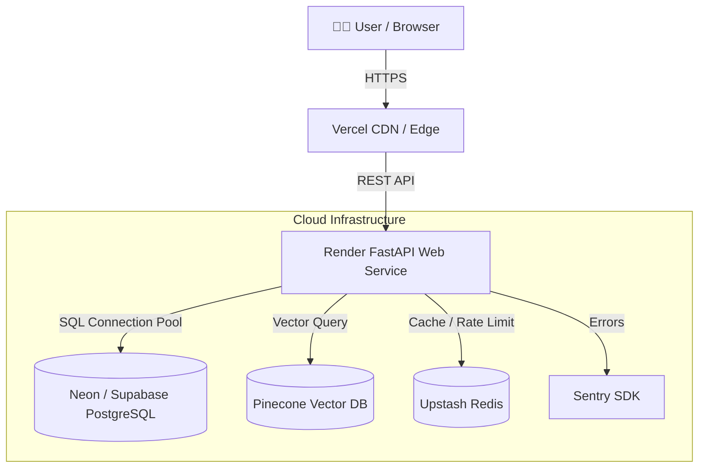

<div align="center">


<a href="https://git.io/typing-svg"></a>

<p align="center">
  <b>Production-Grade Dual-Architecture AI Coding Assistant.</b>
</p>

<!-- Badges -->
<p align="center">
  
  
  
  
  
  
  
</p>

</div>

---

## 🏛️ System Architecture

ReviewForge is engineered to support **TWO completely independent, production-grade deployment models** without altering application business logic.

### Architecture 1: Cloud-Native Deployment (Production)



### Architecture 2: Docker Compose Deployment (Local / Self-Contained)

```mermaid
graph TD
    Client[👨‍💻 User / Browser] -->|HTTP / Port 80| Nginx[Nginx Reverse Proxy]
    
    subgraph Docker Network (reviewforge_net)
        Nginx -->|Port 8501| Streamlit[Frontend Container]
        Nginx -->|Port 8000| FastAPI[Backend Container]
        
        FastAPI -->|Postgres Connection| Postgres[(PostgreSQL Container)]
        FastAPI -->|Cache Connection| Redis[(Redis Container)]
        
        Postgres --- Vol1[(Volume: postgres_data)]
        Redis --- Vol2[(Volume: redis_data)]
        FastAPI --- Vol3[(Volume: app_data)]
    end
```

---

## 🎓 Interview Readiness & System Design Deep-Dive

This repository is optimized to showcase advanced DevOps, cloud architecture, and platform engineering skills during technical interviews.

<details>
<summary><b>1. Why Dual Architectures? (Trade-off Analysis)</b></summary>

- **Cloud-Native Architecture (Render + Vercel + Neon + Pinecone):**
  - **Pros:** Zero infrastructure maintenance, horizontal autoscaling, global CDN distribution via Vercel, pay-per-request pricing.
  - **Cons:** Dependent on vendor SLAs, network latency over internet boundaries.
- **Docker Compose Architecture (Nginx + Backend + Frontend + Postgres + Redis):**
  - **Pros:** 100% environment parity between dev and prod, privacy compliance (air-gapped data stay local), zero cloud costs.
  - **Cons:** Requires local host resource management and storage persistence strategy.
</details>

<details>
<summary><b>2. Security Engineering & Headers</b></summary>

- **HSTS (Strict-Transport-Security):** Enforces HTTPS connections in production (`max-age=31536000`).
- **CORS Hardening:** Restricts API access strictly to whitelisted origins specified in `ALLOWED_ORIGINS` (no wildcards `*` in production).
- **Security Headers:** Includes `X-Frame-Options: DENY`, `X-Content-Type-Options: nosniff`, `Referrer-Policy: strict-origin-when-cross-origin`, and `Permissions-Policy`.
</details>

<details>
<summary><b>3. Database Engineering & Connection Pooling</b></summary>

- **SQLAlchemy Connection Pooling:** Configured with `pool_size=10`, `max_overflow=20`, and `pool_recycle=1800`.
- **Connection Pre-Ping (`pool_pre_ping=True`):** Tests connection liveness before checking out a connection from the pool, preventing stale socket errors on cloud DBs.
- **Hybrid Fallback:** Automatically switches between PostgreSQL (`DATABASE_URL`) and zero-config local SQLite.
</details>

<details>
<summary><b>4. Health Monitoring & Kubernetes Probes</b></summary>

- `/health` — Basic API liveness status.
- `/liveness` — Kubernetes liveness probe checking if the process is responsive.
- `/readiness` — Kubernetes readiness probe checking database connectivity before accepting traffic.
</details>

---

## ⚡ Deployment Instructions

### 🐳 Option 1: Run via Docker Compose (1 Command)

```bash
git clone https://github.com/AyushGU12/ReviewForge.git
cd ReviewForge
docker compose up --build
```
Access the application at `http://localhost`.

### ☁️ Option 2: Deploy to Render & Vercel (Cloud-Native)

1. **Deploy Backend to Render:** Connect repo, Render reads `render.yaml`, provisions PostgreSQL & FastAPI Web Service.
2. **Deploy Frontend to Vercel:** Connect repo, Vercel reads `vercel.json`, hosts `public/index.html` on global CDN.

---

## 🧪 Verification & Testing

Run full linting, format check, type checking, and unit tests:

```bash
# Run linting
flake8 reviewforge/ tests/

# Run type checking
mypy reviewforge/

# Run unit test suite
pytest tests/ -v
```

---

## 📜 License

Distributed under the MIT License. Built with ❤️ by Shikhar.


## Deployment
- Cloud Run CI/CD configured in `.github/workflows/deploy-cloudrun.yml`.
- Run `gcloud run deploy` to deploy the backend.
