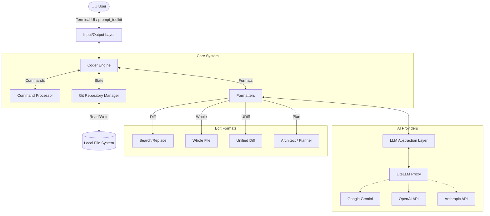
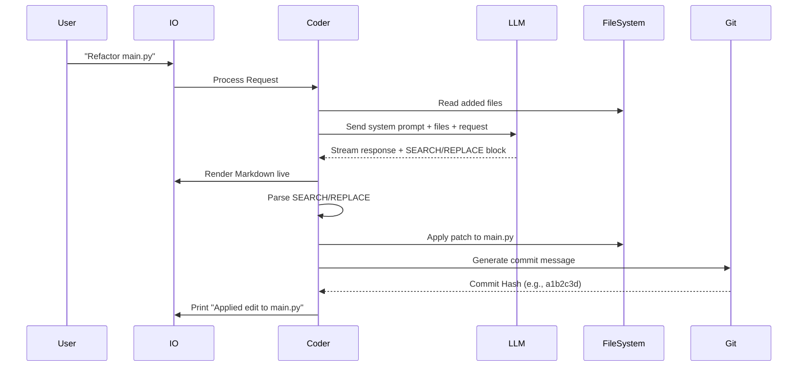
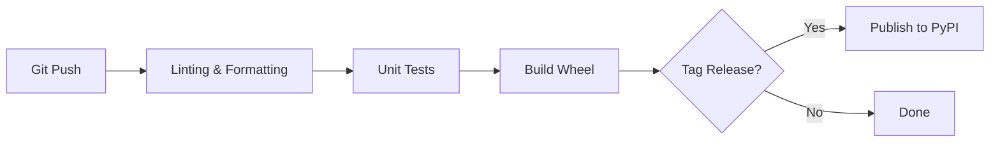
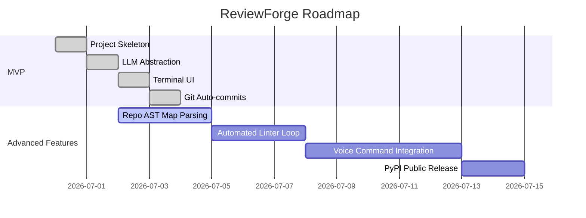

<div align="center">


<a href="https://git.io/typing-svg"></a>

<p align="center">
  <b>Eliminate context switching. Let AI edit your code directly from the terminal.</b>
</p>

<!-- Badges -->
<p align="center">
  
  
  
  
  
  
</p>

</div>

---

## 🚀 Executive Overview

**ReviewForge** is an advanced, production-ready AI command-line pair programming assistant. It fundamentally shifts how developers interact with Large Language Models (LLMs) by moving the conversation out of the browser and directly into the terminal, where the code lives.

### Why ReviewForge Exists
Developers constantly switch context between IDEs, terminals, and web-based AI chat interfaces (like ChatGPT or Claude). Copying and pasting code snippets is error-prone and tedious. ReviewForge solves this by ingesting your local files, understanding your project context, and applying targeted edits directly to your source files.

### Key Highlights
- **Zero Copy-Pasting:** The AI modifies your files in-place using Unified Diffs and precise search/replace blocks.
- **Git Native:** Automatically stages changes, writes sensible AI-generated commit messages, and allows one-command `/undo`.
- **Model Agnostic:** Powered by `LiteLLM`, allowing seamless switching between Gemini (default), GPT-4o, Claude 3.5 Sonnet, DeepSeek, and OpenRouter.

---

## 🏛️ Architecture

ReviewForge follows a modular, layered architecture ensuring separation of concerns between the terminal interface, the underlying language models, the repository state, and the specialized file-editing agents.



### Request Flow
1. **User Input:** User enters a prompt via the interactive terminal.
2. **Context Assembly:** The Coder Engine gathers requested files, read-only context, and the repository map.
3. **LLM Generation:** The context is formatted and streamed to the AI via LiteLLM.
4. **Parsing:** The `EditFormat` parser intercepts code blocks (e.g., SEARCH/REPLACE).
5. **Execution:** File system operations are applied.
6. **Git Operations:** Changes are committed automatically with an AI-generated summary.

---

## 🛠️ Tech Stack

<div align="center">
  <a href="https://skillicons.dev">
    
  </a>
</div>

**Core Dependencies:**
- **UI:** `prompt_toolkit`, `rich`
- **AI/LLM:** `litellm`
- **VCS:** `GitPython`, `pathspec`
- **Parsing:** `tree-sitter` (for Repo Map generation)
- **Caching:** `diskcache`

---

## 📂 Project Structure

```text
📦 ReviewForge
┣ 📂 reviewforge
┃ ┣ 📂 coders               # Format-specific agents (Diff, WholeFile, Architect)
┃ ┃ ┣ 📜 base_coder.py      # Core AI event loop
┃ ┃ ┣ 📜 editblock_coder.py # SEARCH/REPLACE logic
┃ ┃ ┗ 📜 ...
┃ ┣ 📜 __main__.py          # Entry point
┃ ┣ 📜 args.py              # CLI Argument parsing
┃ ┣ 📜 commands.py          # /slash commands execution
┃ ┣ 📜 diffs.py             # Diff colorization & formatting
┃ ┣ 📜 history.py           # Context window summarization
┃ ┣ 📜 io.py                # Terminal Input/Output manager
┃ ┣ 📜 llm.py               # LiteLLM configuration
┃ ┣ 📜 main.py              # Application lifecycle
┃ ┣ 📜 mdstream.py          # Real-time markdown rendering
┃ ┣ 📜 models.py            # Model configurations & defaults
┃ ┣ 📜 repo.py              # Git integration
┃ ┗ 📜 sendchat.py          # Network retry logic & backoff
┣ 📜 pyproject.toml         # Package definition
┣ 📜 .gitignore
┗ 📜 README.md
```

---

## ✨ Features

<details open>
<summary><b>✅ Completed</b></summary>

- **Core:** In-place file editing, interactive terminal chat session, context window tracking.
- **Git Integration:** Auto-commit, dirty tree detection, instant `/undo`, `.gitignore` awareness.
- **AI Models:** Gemini 2.0 Flash (Default), GPT-4o, Claude 3.5 Sonnet, DeepSeek R1 via LiteLLM.
- **Commands:** Robust slash commands (`/add`, `/drop`, `/ls`, `/commit`, `/clear`, `/run`, `/model`).
- **Terminal UI:** Markdown streaming, syntax highlighting, animated spinners, terminal-native file auto-completion.
- **Resilience:** Exponential backoff for rate limits, context window summarization when tokens exceed limits.
</details>

<details>
<summary><b>🚧 In Progress</b></summary>

- **Repo Map Generation:** Abstract Syntax Tree (AST) parsing via `tree-sitter` to provide the LLM with a structural map of the entire repository.
- **Automated Linter/Testing Loop:** Auto-fix errors by piping compiler/linter outputs back into the LLM automatically.
</details>

<details>
<summary><b>📌 Planned</b></summary>

- **Web Scraping:** The ability for the agent to fetch external documentation via `/web <url>`.
- **Voice Input:** Talk to your code via local transcription models.
- **Browser GUI:** An optional local web interface for users who prefer visual diffing.
</details>

---

## 📦 Installation

### Prerequisites
- Python 3.9+
- Git installed and accessible via PATH.

### Local Installation (Recommended)

Install directly from the GitHub repository using `pip`:

```bash
pip install git+https://github.com/AyushGU12/ReviewForge.git
```

Or, clone the repository for development:

```bash
git clone https://github.com/AyushGU12/ReviewForge.git
cd ReviewForge
pip install -e .
```

### Environment Variables

ReviewForge requires API keys for the language models you intend to use.

```bash
# For default Gemini model
export GEMINI_API_KEY="your_api_key_here"

# For OpenAI models
export OPENAI_API_KEY="your_api_key_here"

# For Anthropic models
export ANTHROPIC_API_KEY="your_api_key_here"
```

---

## ⚙️ Configuration

ReviewForge reads settings from command-line arguments or a YAML configuration file.

Create a `.reviewforge.conf.yml` in your project root or `~/.reviewforge.conf.yml`:

```yaml
# Model Settings
model: gemini/gemini-2.0-flash
weak-model: gemini/gemini-1.5-flash
edit-format: diff

# Output Settings
dark-mode: true
pretty: true
stream: true

# Git Settings
git: true
auto-commits: true
dirty-commits: true
```

---

## 🧠 AI/ML Section

### Model Overview
ReviewForge interacts with LLMs fundamentally as text-generation APIs, but uses heavily optimized prompt engineering to enforce structured outputs.

### Architecture



### Prompt Engineering
ReviewForge relies on system prompts defined in `prompts.py` and format-specific subclasses (e.g., `EditBlockPrompts`). The AI is instructed to return edits inside specific markdown fences (like `<<<<<<< SEARCH` and `>>>>>>> REPLACE`) which the `Coder` regex parser strictly validates before mutating the local filesystem.

---

## 🛡️ Security

- **Secrets Management:** API keys are read exclusively from environment variables and are never stored in log files or configuration files.
- **Local Execution:** ReviewForge runs entirely locally. Source code is only sent to the specific LLM API provider you configure. No telemetry or code is sent to ReviewForge servers (as none exist).
- **Audit Logs:** All LLM inputs and outputs can be locally logged by specifying `--llm-history-file .reviewforge.log`.
- **Destructive Operations:** ReviewForge only modifies files you explicitly `/add` to the chat context. 

---

## ⚡ Performance & Scalability

- **Context Window Management:** ReviewForge implements a `ChatSummary` class. When the conversation history exceeds the model's maximum token limit, a "weak" background model automatically summarizes older conversation turns, retaining the technical context while drastically shrinking the token footprint.
- **Streaming:** Responses are streamed chunk-by-chunk using `rich.Live`, ensuring near-zero perceived latency on the terminal UI.
- **Rate Limit Resilience:** The `sendchat.py` module wraps `litellm` calls in an exponential backoff decorator utilizing the `backoff` library, gracefully handling `429 Too Many Requests` API errors.

---

## 🧪 Testing

ReviewForge architecture is built to support robust testing:

*To Be Configured - Automated testing suite coming soon.*

- **Linting:** Enforced via `flake8` and `black`.
- **Static Analysis:** `mypy` for strict type checking.

---

## 🔄 CI/CD

ReviewForge uses GitHub Actions for Continuous Integration.



*Note: PyPI deployment pipeline is currently under configuration.*

---

## 🐳 Deployment & Containerization

While primarily a CLI tool, ReviewForge can be run via Docker to isolate dependencies and prevent local filesystem contamination (mounting the target directory as a volume).

```dockerfile
FROM python:3.11-slim
WORKDIR /app
COPY . /app
RUN pip install -e .
ENTRYPOINT ["reviewforge"]
```

**Usage:**
```bash
docker build -t reviewforge .
docker run -it -v $(pwd):/workspace -w /workspace -e GEMINI_API_KEY=$GEMINI_API_KEY reviewforge
```

---

## 🗺️ Roadmap



---

## 🤝 Contributing

We welcome contributions! Please follow our standard workflow:

1. **Fork** the repository.
2. **Create a Feature Branch** (`git checkout -b feature/AmazingFeature`).
3. **Commit your changes** following [Conventional Commits](https://www.conventionalcommits.org/).
    - `feat:` for new features
    - `fix:` for bug fixes
    - `docs:` for documentation updates
4. **Push to the Branch** (`git push origin feature/AmazingFeature`).
5. **Open a Pull Request**.

---

## ❓ FAQ

**Q: Which model should I use?**  
A: For the best coding results, we recommend `gemini/gemini-2.0-flash`, `gpt-4o`, or `anthropic/claude-3-5-sonnet-20241022`. They have the strongest instruction-following capabilities for the required SEARCH/REPLACE diff blocks.

**Q: How do I stop it from committing every change?**  
A: Launch ReviewForge with the `--no-auto-commits` flag, or set `auto-commits: false` in your `.reviewforge.conf.yml`.

**Q: Can it read my entire codebase?**  
A: Yes. In future updates, the `RepoMap` feature will build an AST map of your entire project so the LLM understands files you haven't explicitly added to the chat.

---

## 🐛 Troubleshooting

| Issue | Solution |
|-------|----------|
| `litellm.AuthenticationError` | Ensure your `*_API_KEY` is correctly exported in your terminal session. |
| The AI generates code but doesn't apply the edit | The model may have hallucinated the markdown formatting. Try using a stronger model like GPT-4o, or use `/undo` and prompt it again. |
| `fatal: not a git repository` | ReviewForge works best inside an initialized git directory. Run `git init` in your folder. |

---

## 📜 License

Distributed under the MIT License. See `LICENSE` for more information.

---

<div align="center">


[](https://github.com/AyushGU12)

**Made with ❤️ by Shikhar**

⭐ *Star this repository if you found it useful!*

</div>
